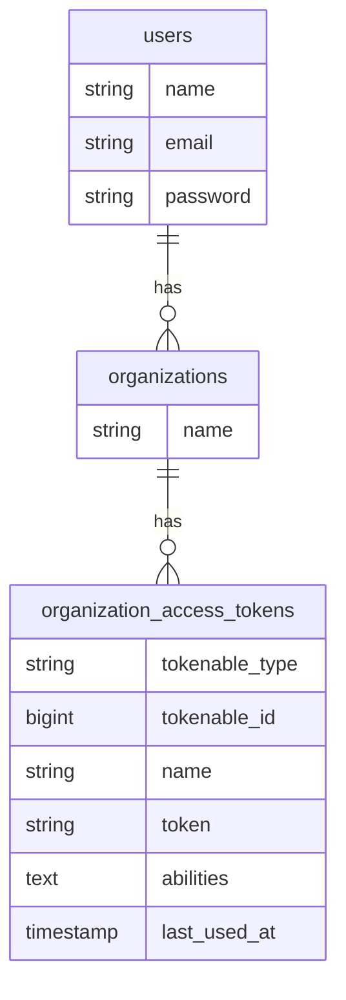

# Laravel Sanctum を少し使ったメモ

Laravel Sanctum は Token を発行して、HTTP の `Authorization` ヘッダーをかいしてHTTPリクエストを認証するような仕組みです。Github のパーソナルアクセストークンみたいな感じ。

今回はユーザ単位にトークンを発行するのではなく、ユーザが属してる組織単位でトークンを発行しようとし、SPAでは使わないという感じにする。

そいで、どうも JetStream を使えば楽にできるみたいなんですが、今回はパスしてます。

- PHP 7.4
- Laravel 8.56.0
- laravel/sanctum v2.11.2


## 導入方法

インストールなどはドキュメント読んで。

see : https://readouble.com/laravel/8.x/ja/sanctum.html


### 導入後の変更点

1. `php artisan vendor:publish --tag=sanctum-migrations` の後に `database/migrations/2019_12_14_000001_create_personal_access_tokens_table.php` が作成され `personal_tokens` テーブルを作りますが、名前が紛らわしいので `organization_access_tokens` に変更をしています。

## ER 図

ユーザ `users` は 複数の組織 `organizations` に属している形。



# 設定の変更

API Token として使いたいだけなので API 経由で CSRF-Token の取得は不要です。したがって `config/sanctum.php` に一行追加してやります。

```php
<?php
// config/sanctum.php

    // 以下追加
    // API Tokenとして使い、SPAとしては使わないので Routing にある csrf-token はオフにする
    'routes' => false,
];
```

## Eloquent の作成

organizations テーブル を追加した後、色々使うので `App\Models\Organization` を追加する。（全部書いたら長いので最低部分だけ）


```php
<?php
// app/Models/Organizations.php
namespace App\Models;

/**
 * Authenticatable を満たさないと Auth::user() で取ってこれなくなるので、無理やり実装
 */ 
class Organizations extends Model implements Authenticatable
{
    use HasFactory, HasApiTokens; // HasApiTokens が必須

    protected $table = 'organizations';
...
}
```

## 認証を Organization にする

Sanctum の標準では User に紐づく形になっていますが、今回は Organizations という所に関連づけをするので、それの設定を変更します。これには、まず Laravel が用意している `PersonalAccessToken` を継承したクラスを用意し、 `AppServiceProvider` でデフォルトモデルのオーバーライドをしてやる必要があります。ここは [公式-- readouble.com/laravel/8.x](https://readouble.com/laravel/8.x/ja/sanctum.html#overriding-default-models) に載ってますね 。

まず `PersonalAccessToken` を継承したクラス `OrganizationTokens` を用意してやります。

```php
<?php
// app/Models/OrganizationTokens.php
namespace App\Models;

use Laravel\Sanctum\PersonalAccessToken as SanctumPersonalAccessToken;

class OrganizationTokens extends SanctumPersonalAccessToken
{
    protected $table = 'organization_access_tokens';
}

```

そして、デフォルトモデルをオーバーライドしてやります。

```php
<?php
// app/Providers/AppServiceProvider.php
class AppServiceProvider extends ServiceProvider
{
    /**
     * @return void
     */
    public function boot()
    {
        // Token は user ではなく organizations に紐付けているので、意図的に置き換えてやる
        \Laravel\Sanctum\Sanctum::usePersonalAccessTokenModel( \App\Models\OrganizationTokens::class );
    }
}
```

#### 個人的メモ書き 挙動メモ

今までだと `User` に email/password があり、それがそのまま Auth::user() で返してきますが、今回は `OrganizationTokens` で認証して、Auth::user() が返す値は `Organizations` の値になります。この違いは何かとぼんやり流れを追ったら、 Auth::user() で返す値は [Sumctum の Guard -- github](https://github.com/laravel/sanctum/blob/2.x/src/Guard.php) をみると、`PersonalAccessToken` にある `tokenable` メソッドの値を返してます。こいつの中身は `return $this->morphTo('tokenable');` という感じになっており、実テーブルを見ると `tokenable_type/tokenable_id` の２つのカラムを生成して、それぞれ `App\Models\Organizations` と `1` といった感じで保存しています。要は [ポリモーフィックリレーション](https://readouble.com/laravel/8.x/ja/eloquent-relationships.html#polymorphic-relationships) ですね。


### 1. auth.guards.sanctum と auth.providers.organizations を追加


```php
<?php
// config/auth.php
return [
    'guards' => [

    	// 追加
        'sanctum' => [
            'driver' => 'sanctum',
            'provider' => 'organizations'
        ],
    ],
    'providers' => [

    	// 追加
        'organizations' => [
            'driver' => 'eloquent',
            'model' => App\Models\Organizations::class,
        ]
    ]
]

```

### 2. 使ってみる

`api.php` にさらっと Organizationの情報を返すように仕向けてみます。

```php
<?php
// routes/api.php
Route::group( ['middleware' => 'auth:sanctum'], function () {
    Route::get( '/user', function ( Request $request ) {
        return [
            'class' => get_class($request->user()),
            'data' => $request->user()
        ];
    } );
} );

```

以下実行結果

```shell
⚑  curl -vvv -H 'Authorization: Bearer 4|ZFbPA7Ul9iPaoHz6m3o4eAQ2crL5NsNh8zC9gg8K'  -H 'Content-Type: application/json' -H 'Accept: application/json'  http://hoge_test.homestead/api/user
*   Trying 192.168.73.10...
* TCP_NODELAY set
* Connected to hoge_test.homestead (192.168.73.10) port 80 (#0)
> GET /api/user HTTP/1.1
> Host: hoge_test.homestead
> User-Agent: curl/7.64.1
> Authorization: Bearer 4|ZFbPA7Ul9iPaoHz6m3o4eAQ2crL5NsNh8zC9gg8K
> Content-Type: application/json
> Accept: application/json
> 
< HTTP/1.1 200 OK
< Server: nginx/1.18.0 (Ubuntu)
< Content-Type: application/json
< Transfer-Encoding: chunked
< Connection: keep-alive
< Cache-Control: no-cache, private
< Date: Thu, 02 Sep 2021 07:30:07 GMT
< X-RateLimit-Limit: 60
< X-RateLimit-Remaining: 59
< phpdebugbar-id: X7162886b2e4875d8bc109a63ad1e2fa1
< Access-Control-Allow-Origin: *
< 
* Connection #0 to host hoge_test.homestead left intact
{"class":"App\\Models\\Organizations","data":{"id":1,"name":"hoge","created_at":"2021-09-01T12:15:48.000000Z","updated_at":"2021-09-01T12:15:48.000000Z"}}* Closing connection 0

```


## テスト

ちょっとトリッキーな事をしているので、テストもそれに合わせてトリッキーにします。まず、よくある `$this->actingAPIAs($organization)->get(url)` といった感じで API の取得ができるようにする元となるクラスを用意して、書き込んでいきます。

```php
<?php
// tests/APIDatabaseTestCase.php
namespace Tests;

use App\Models\Organizations;
use Laravel\Sanctum\Sanctum;

/**
 *
 */
abstract class APIDatabaseTestCase extends DatabaseTestCase
{
    /**
     * @param Organizations $organizations
     * @param array $abilities
     * @return $this
     */
    public function actingAPIAs( Organizations $organizations, $abilities = [] )
    {
        Sanctum::actingAs( $organizations, $abilities );
        return $this;
    }

    /**
     * @param string $uri
     * @param array $headers
     * @return \Illuminate\Testing\TestResponse
     */
    public function get( $uri, array $headers = [] )
    {
        return parent::get( $uri, array_merge( [
            'Content-Type' => 'application/json',
            'Accept' => 'application/json'
        ], $headers ) );
    }

    /**
     * @param string $uri
     * @param array $data
     * @param array $headers
     * @return \Illuminate\Testing\TestResponse
     */
    public function post( $uri, array $data = [], array $headers = [] )
    {
        return parent::post( $uri, $data, array_merge( [
            'Content-Type' => 'application/json',
            'Accept' => 'application/json'
        ], $headers ) );
    }
}

```

後はこのクラスを継承して、テストメソッドで `$this->actingAPIAs($organization)->get(url)` といった感じで書いていく。


