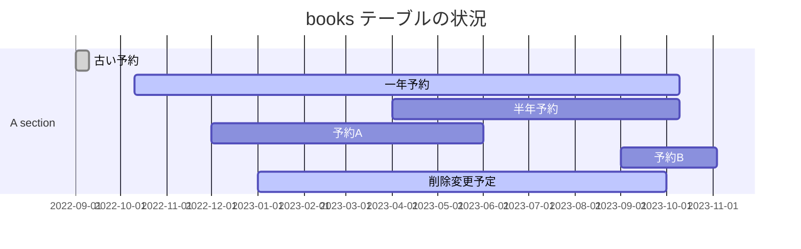

[Temportal Table -- mariadb.com](https://mariadb.com/kb/en/temporal-tables/) のメモ書き。

この機能は [SQL:2011 -- wikipedia.org](https://en.wikipedia.org/wiki/SQL:2011) に準じているみたいです。MariaDBでは [10.3.4 で追加 -- mariadb.com](https://mariadb.com/kb/en/changes-improvements-in-mariadb-10-3/)された機能であり、 [10.4.3 で Application Time Periods -- mariadb.com](https://mariadb.com/kb/en/mariadb-1043-release-notes/) が使えるようになりました。他のデータベースソフトでは [SQL Server 2016 -- learn.microsoft.com](https://learn.microsoft.com/ja-jp/sql/relational-databases/tables/temporal-tables?view=sql-server-ver16) や [Oracle 12c -- www.oracle.com](https://www.oracle.com/webfolder/technetwork/tutorials/obe/db/12c/r1/ilm/temporal/temporal.html) で使えるみたいです。

Temportal Table は主にデータの変更履歴を管理するための機能である。

三種類あって System Versioning Tables , Application Time Periods , Bitemporal Tables の三種類がある。

- System Versioning Tables はクエリーとデータの変更履歴をテーブル単位で持ちます。
- Application Time Periods はデータ内にある日付データをを見て操作することができます。
- Bitemporal Tables は System Versioning Tables と Application Time Periods の複合物です。

個人的にはバックアップを取ったときのデータ容量とか内容がどうなるんやという疑問があるのでメモ書き。

# System Versioning Tables

システムデータを使って、テーブルのデータを操作した履歴や、テーブル自体の操作履歴を保持します。

この機能は、テーブルの作成時に機能を有効することができます。そして、途中から有効にする事もできます。この機能の副作用として TRUNCATE は動きません。^[ただしこれは MariaDB 10.4.5 以上のバージョンに限ります。それより前は消してしまいます。]

:::message
SQL 2011 では START/END のカラムが必要ですが、Maria DB では無くても動きます。他のデータベースに移行する事を考える時は必要になると思います。

ただ注意が必要なのが START/END のカラムを書かずに作成した場合、 `ROW_START`/`ROW_END` の隠しカラムみたいなのを持ちます。名前が重複しないように注意をしたほうが良いです。

```sql
-- SQL:2011
CREATE TABLE t(
   x INT,
   start_timestamp TIMESTAMP(6) GENERATED ALWAYS AS ROW START,
   end_timestamp TIMESTAMP(6) GENERATED ALWAYS AS ROW END,
   PERIOD FOR SYSTEM_TIME(start_timestamp, end_timestamp)
) WITH SYSTEM VERSIONING;

-- Mariadb
CREATE TABLE t(
   x INT
) WITH SYSTEM VERSIONING;
```
:::

Alter文を使って途中から追加すると、下記のような感じになる。

```sql
----------------------------------------------------------------------------------
-- MariaDB:: 途中から Alter文で追加/削除することができる。
CREATE TABLE t( x INT );
ALTER TABLE t ADD SYSTEM VERSIONING;

> show create table t\G
*************************** 1. row ***************************
       Table: t
Create Table: CREATE TABLE `t` (
  `x` int(11) DEFAULT NULL
) ENGINE=InnoDB DEFAULT CHARSET=utf8mb4 COLLATE=utf8mb4_general_ci WITH SYSTEM VERSIONING
1 row in set (0.003 sec)

----------------------------------------------------------------------------------
-- 他のデータベースと同様に start/end カラムを追加する場合

ALTER TABLE t ADD COLUMN ts TIMESTAMP(6) GENERATED ALWAYS AS ROW START,
              ADD COLUMN te TIMESTAMP(6) GENERATED ALWAYS AS ROW END,
              ADD PERIOD FOR SYSTEM_TIME(ts, te),
              ADD SYSTEM VERSIONING;

> show create table t\G
*************************** 1. row ***************************
       Table: t
Create Table: CREATE TABLE `t` (
  `x` int(11) DEFAULT NULL,
  `ts` timestamp(6) GENERATED ALWAYS AS ROW START,
  `te` timestamp(6) GENERATED ALWAYS AS ROW END,
  PERIOD FOR SYSTEM_TIME (`ts`, `te`)
) ENGINE=InnoDB DEFAULT CHARSET=utf8mb4 COLLATE=utf8mb4_general_ci WITH SYSTEM VERSIONING
1 row in set (0.000 sec)

> show fields from t;
+-------+--------------+------+-----+---------+------------------+
| Field | Type         | Null | Key | Default | Extra            |
+-------+--------------+------+-----+---------+------------------+
| x     | int(11)      | YES  |     | NULL    |                  |
| ts    | timestamp(6) | NO   |     | NULL    | STORED GENERATED |
| te    | timestamp(6) | NO   |     | NULL    | STORED GENERATED |
+-------+--------------+------+-----+---------+------------------+
3 rows in set (0.010 sec)

-- この状態で versioning を消そうとしてもコケる。
-- この状態のテーブルに付いている versioning の消し方はちょっとわからん。
> alter table t drop system versioning;
ERROR 4125 (HY000): Wrong parameters for `t`: missing 'DROP COLUMN `ts`'

----------------------------------------------------------------------------------
-- 削除
ALTER TABLE t DROP SYSTEM VERSIONING;

> show create table t\G
*************************** 1. row ***************************
       Table: t
Create Table: CREATE TABLE `t` (
  `x` int(11) DEFAULT NULL
) ENGINE=InnoDB DEFAULT CHARSET=utf8mb4 COLLATE=utf8mb4_general_ci
1 row in set (0.003 sec)

```

## データの挿入と更新

追加・更新をしてみて、データがどういう入り方をするかを見る。

```sql
--------------------------------------------------------------------------------------
-- ドキュメントに書いている通りにまず実行をする

> select now();
+---------------------+
| now()               |
+---------------------+
| 2023-10-04 07:47:11 |
+---------------------+
1 row in set (0.001 sec)

MariaDB [sys_temporal]> insert into t values(1);
Query OK, 1 row affected (0.004 sec)

MariaDB [sys_temporal]> set @@timestamp = UNIX_TIMESTAMP('2033-10-01');
Query OK, 0 rows affected (0.000 sec)

MariaDB [sys_temporal]> insert into t values(2);
Query OK, 1 row affected (0.001 sec)

MariaDB [sys_temporal]> set @@timestamp = default;
Query OK, 0 rows affected (0.000 sec)

MariaDB [sys_temporal]> insert into t values(3);
Query OK, 1 row affected (0.002 sec)

MariaDB [sys_temporal]> select x,row_start,row_end from t;
+------+----------------------------+----------------------------+
| x    | row_start                  | row_end                    |
+------+----------------------------+----------------------------+
|    1 | 2023-10-04 07:47:17.900020 | 2038-01-19 03:14:07.999999 |
|    2 | 2033-10-01 00:00:00.000000 | 2038-01-19 03:14:07.999999 |
|    3 | 2023-10-04 07:47:47.113555 | 2038-01-19 03:14:07.999999 |
+------+----------------------------+----------------------------+
3 rows in set (0.001 sec)

--------------------------------------------------------------------------------------
-- 未来に行き、データを１件消してみる

MariaDB [sys_temporal]> set @@timestamp = UNIX_TIMESTAMP('2028-01-01');
Query OK, 0 rows affected (0.004 sec)

MariaDB [sys_temporal]> delete from t where x = 3;
Query OK, 1 row affected (0.006 sec)

MariaDB [sys_temporal]> insert into t values (4);
Query OK, 1 row affected (0.001 sec)

MariaDB [sys_temporal]> set @@timestamp = default;
Query OK, 0 rows affected (0.001 sec)

MariaDB [sys_temporal]> select x,row_start,row_end from t;
+------+----------------------------+----------------------------+
| x    | row_start                  | row_end                    |
+------+----------------------------+----------------------------+
|    1 | 2023-10-04 07:47:17.900020 | 2038-01-19 03:14:07.999999 |
|    2 | 2033-10-01 00:00:00.000000 | 2038-01-19 03:14:07.999999 |
|    4 | 2028-01-01 00:00:00.000000 | 2038-01-19 03:14:07.999999 |
+------+----------------------------+----------------------------+
3 rows in set (0.002 sec)

--------------------------------------------------------------------------------------
-- 未来で入れた値と同じ値のデータを入れてみる。
MariaDB [sys_temporal]> select NOW();
+---------------------+
| NOW()               |
+---------------------+
| 2023-10-04 07:50:50 |
+---------------------+
1 row in set (0.001 sec)

MariaDB [sys_temporal]> insert into t values(4);
Query OK, 1 row affected (0.002 sec)

MariaDB [sys_temporal]> select *, ROW_START, ROW_END from t;
+------+----------------------------+----------------------------+
| x    | ROW_START                  | ROW_END                    |
+------+----------------------------+----------------------------+
|    1 | 2023-10-04 07:47:17.900020 | 2038-01-19 03:14:07.999999 |
|    2 | 2033-10-01 00:00:00.000000 | 2038-01-19 03:14:07.999999 |
|    4 | 2028-01-01 00:00:00.000000 | 2038-01-19 03:14:07.999999 |
|    4 | 2023-10-04 07:50:59.064405 | 2038-01-19 03:14:07.999999 |
+------+----------------------------+----------------------------+
4 rows in set (0.001 sec)

--------------------------------------------------------------------------------------
-- 未来に行き、データを更新してみる。
MariaDB [sys_temporal]> set @@timestamp = UNIX_TIMESTAMP('2027-12-12');
Query OK, 0 rows affected (0.002 sec)

MariaDB [sys_temporal]> UPDATE t set x = 4 where x = 2;
Query OK, 1 row affected (0.007 sec)
Rows matched: 1  Changed: 1  Inserted: 1  Warnings: 0

MariaDB [sys_temporal]> select *, ROW_START, ROW_END from t;
+------+----------------------------+----------------------------+
| x    | ROW_START                  | ROW_END                    |
+------+----------------------------+----------------------------+
|    1 | 2023-10-04 07:47:17.900020 | 2038-01-19 03:14:07.999999 |
|    4 | 2027-12-12 00:00:00.000000 | 2038-01-19 03:14:07.999999 |
|    4 | 2028-01-01 00:00:00.000000 | 2038-01-19 03:14:07.999999 |
|    4 | 2023-10-04 07:50:59.064405 | 2038-01-19 03:14:07.999999 |
+------+----------------------------+----------------------------+
4 rows in set (0.002 sec)

MariaDB [sys_temporal]> set @@timestamp = default;
Query OK, 0 rows affected (0.000 sec)

MariaDB [sys_temporal]> select *, ROW_START, ROW_END from t;
+------+----------------------------+----------------------------+
| x    | ROW_START                  | ROW_END                    |
+------+----------------------------+----------------------------+
|    1 | 2023-10-04 07:47:17.900020 | 2038-01-19 03:14:07.999999 |
|    4 | 2027-12-12 00:00:00.000000 | 2038-01-19 03:14:07.999999 |
|    4 | 2028-01-01 00:00:00.000000 | 2038-01-19 03:14:07.999999 |
|    4 | 2023-10-04 07:50:59.064405 | 2038-01-19 03:14:07.999999 |
+------+----------------------------+----------------------------+
4 rows in set (0.001 sec)


```

### 時間を歪ましたデータ操作のまとめ

ここまででぐちゃぐちゃにデータがなっていることがわかる。少し整理をします。

- 2023-10-04 :: 値 1, 3, 4 を追加
- 2027-12-12 :: 値 2 を 4 に変更
- 2028-01-01 :: 値 3 を削除、4 を追加
- 2033-10-01 :: 値 2 を追加

データ挿入・削除はこんな感じになる。多分 2027-12-12 が変なことになるはず（2027-12-12 時点では 2は存在しないため）だが、現状どうなっているかを見る。

```sql
MariaDB [sys_temporal]> select NOW();
+---------------------+
| NOW()               |
+---------------------+
| 2023-10-04 08:02:48 |
+---------------------+
1 row in set (0.004 sec)

MariaDB [sys_temporal]> SELECT *, ROW_START, ROW_END FROM t FOR SYSTEM_TIME BETWEEN (NOW() - INTERVAL 1 YEAR) AND NOW();
+------+----------------------------+----------------------------+
| x    | ROW_START                  | ROW_END                    |
+------+----------------------------+----------------------------+
|    1 | 2023-10-04 07:47:17.900020 | 2038-01-19 03:14:07.999999 |
|    3 | 2023-10-04 07:47:47.113555 | 2028-01-01 00:00:00.000000 |
|    4 | 2023-10-04 07:50:59.064405 | 2038-01-19 03:14:07.999999 |
+------+----------------------------+----------------------------+
3 rows in set (0.004 sec)


MariaDB [sys_temporal]> SELECT *, ROW_START, ROW_END FROM t FOR SYSTEM_TIME BETWEEN '2027-01-01' AND '2027-12-30';
+------+----------------------------+----------------------------+
| x    | ROW_START                  | ROW_END                    |
+------+----------------------------+----------------------------+
|    1 | 2023-10-04 07:47:17.900020 | 2038-01-19 03:14:07.999999 |
|    4 | 2027-12-12 00:00:00.000000 | 2038-01-19 03:14:07.999999 |
|    3 | 2023-10-04 07:47:47.113555 | 2028-01-01 00:00:00.000000 |
|    4 | 2023-10-04 07:50:59.064405 | 2038-01-19 03:14:07.999999 |
+------+----------------------------+----------------------------+
4 rows in set (0.002 sec)


--------------------------------------------------------------------------------------
-- 問題となっている日を見る。データ変更ではなく、データが入っていることがわかる。

MariaDB [sys_temporal]> SELECT *, ROW_START, ROW_END FROM t FOR SYSTEM_TIME as of TIMESTAMP'2027-12-11 00:00:00';
+------+----------------------------+----------------------------+
| x    | ROW_START                  | ROW_END                    |
+------+----------------------------+----------------------------+
|    1 | 2023-10-04 07:47:17.900020 | 2038-01-19 03:14:07.999999 |
|    3 | 2023-10-04 07:47:47.113555 | 2028-01-01 00:00:00.000000 |
|    4 | 2023-10-04 07:50:59.064405 | 2038-01-19 03:14:07.999999 |
+------+----------------------------+----------------------------+
3 rows in set (0.001 sec)

MariaDB [sys_temporal]> SELECT *, ROW_START, ROW_END FROM t FOR SYSTEM_TIME as of TIMESTAMP'2027-12-12 00:00:00';
+------+----------------------------+----------------------------+
| x    | ROW_START                  | ROW_END                    |
+------+----------------------------+----------------------------+
|    1 | 2023-10-04 07:47:17.900020 | 2038-01-19 03:14:07.999999 |
|    4 | 2027-12-12 00:00:00.000000 | 2038-01-19 03:14:07.999999 |
|    3 | 2023-10-04 07:47:47.113555 | 2028-01-01 00:00:00.000000 |
|    4 | 2023-10-04 07:50:59.064405 | 2038-01-19 03:14:07.999999 |
+------+----------------------------+----------------------------+
4 rows in set (0.001 sec)

--------------------------------------------------------------------------------------
-- 過去に変えられるデータを追加した日がどうなっているか見る。
MariaDB [sys_temporal]> SELECT *, ROW_START, ROW_END FROM t FOR SYSTEM_TIME as of TIMESTAMP'2033-09-29 00:00:00';
+------+----------------------------+----------------------------+
| x    | ROW_START                  | ROW_END                    |
+------+----------------------------+----------------------------+
|    1 | 2023-10-04 07:47:17.900020 | 2038-01-19 03:14:07.999999 |
|    4 | 2027-12-12 00:00:00.000000 | 2038-01-19 03:14:07.999999 |
|    4 | 2028-01-01 00:00:00.000000 | 2038-01-19 03:14:07.999999 |
|    4 | 2023-10-04 07:50:59.064405 | 2038-01-19 03:14:07.999999 |
+------+----------------------------+----------------------------+
4 rows in set (0.001 sec)

MariaDB [sys_temporal]> SELECT *, ROW_START, ROW_END FROM t FOR SYSTEM_TIME as of TIMESTAMP'2033-10-01 00:00:00';
+------+----------------------------+----------------------------+
| x    | ROW_START                  | ROW_END                    |
+------+----------------------------+----------------------------+
|    1 | 2023-10-04 07:47:17.900020 | 2038-01-19 03:14:07.999999 |
|    4 | 2027-12-12 00:00:00.000000 | 2038-01-19 03:14:07.999999 |
|    4 | 2028-01-01 00:00:00.000000 | 2038-01-19 03:14:07.999999 |
|    4 | 2023-10-04 07:50:59.064405 | 2038-01-19 03:14:07.999999 |
+------+----------------------------+----------------------------+
4 rows in set (0.001 sec)
-- 変えられているので、2は存在しなことになった気配。
```

日付を気にせず、とりあえず全件取得する。

```sql
MariaDB [sys_temporal]> select NOW();
+---------------------+
| NOW()               |
+---------------------+
| 2023-10-04 08:09:52 |
+---------------------+
1 row in set (0.002 sec)

MariaDB [sys_temporal]> SELECT * FROM t FOR SYSTEM_TIME ALL;
+------+
| x    |
+------+
|    1 |
|    4 |
|    3 |
|    4 |
|    4 |
+------+
5 rows in set (0.002 sec)
```

### View や サブクエリー等

View の作成時やサブクエリー発行時に日付指定はでき、 `<table> FOR SYSTEM_TIME AS OF TIMESTAMP'2016-10-09 08:07:06';` といった感じになる。

```sql
CREATE VIEW v1 AS SELECT * FROM t FOR SYSTEM_TIME AS OF TIMESTAMP'2016-10-09 08:07:06';

-- or

CREATE VIEW v1 AS SELECT * FROM t;
SELECT * FROM v1 FOR SYSTEM_TIME AS OF TIMESTAMP'2016-10-09 08:07:06';
```

### その他

パーティションなどは一ヶ月単位で切り分けられたりできる。

```sql
CREATE TABLE t (x INT) WITH SYSTEM VERSIONING 
  PARTITION BY SYSTEM_TIME 
    INTERVAL 1 MONTH 
    PARTITIONS 12;

-- 10.9.1 から AUTO 属性もつけられるようになった。auto をつけるとどうなる…？
CREATE TABLE t1 (x int) WITH SYSTEM VERSIONING
   PARTITION BY SYSTEM_TIME INTERVAL 1 MONTH
   STARTS '2021-01-01 00:00:00' AUTO PARTITIONS 12;

```

## 削除

Versioning を削除することもできます。そして再追加をする事もできます。ディスク容量が多くなり、履歴が不要になった等がある時はこんな感じでパージするのはありっぽい。

```sql
ALTER TABLE t DROP SYSTEM VERSIONING;
ALTER TABLE t ADD SYSTEM VERSIONING;

-- パーティションを使っている時はこんな感じ
ALTER TABLE t DROP PARTITION p0;

-- もちろん、普通に履歴全件を消すことも可能
DELETE HISTORY FROM t;

-- 指定日以前の履歴削除も可能
DELETE HISTORY FROM t BEFORE SYSTEM_TIME '2016-10-09 08:07:06';

```

注意事項として、履歴機能の副作用として TRANCATE は動かないようになっていますが、[MariaDB 10.4.5](https://mariadb.com/kb/en/mariadb-1045-release-notes/) より前は動きます。

### 特定のカラムのみ履歴機能を使う

テーブル全体でやるのが良いと思いますが、特定のカラムはもたなくて良い、持ちたい、などの事ができます。

```sql
-- y のカラムは履歴機能を使わない
CREATE TABLE t (
   x INT,
   y INT WITHOUT SYSTEM VERSIONING
) WITH SYSTEM VERSIONING;

-- テーブルでは履歴機能を使わないが、xだけ使いたい。
CREATE TABLE t (
   x INT WITH SYSTEM VERSIONING,
   y INT
);

```

# Application Time Periods

see : [Application-Time Periods -- mariadb.com](https://mariadb.com/kb/en/application-time-periods/)

テーブルカラム内にある２つの時間型（ *DATE*/*DATETIME*/*TIMESTAMP* の三種類のみ、_YEAR_/_TIME_ は未サポート）を見て、期間指定をすることができる。これは System Versioning とは別の機能になる。

英語的には Time Period と書いているので、それに習って Time Period と書いていく。


## TimePeriod を追加したテーブルの操作

サンプルから。

```sql
MariaDB [sys_temporal]> create table rooms(
	room_number int,
	guest_name varchar(25),
	checkin date,
	checkout date,
	period for date_period(checkin, checkout));
Query OK, 0 rows affected (0.021 sec)

------------------------------------------------------------------------------------------------
-- 作成したテーブル情報

MariaDB [sys_temporal]> show create table rooms\g;
+-------+------------------------------------------------------------------------------------------------------------------------------------------------------------------------------------------------------------------------------------------------------------------------------------+
| Table | Create Table                                                                                                                                                                                                                                                                       |
+-------+------------------------------------------------------------------------------------------------------------------------------------------------------------------------------------------------------------------------------------------------------------------------------------+
| rooms | CREATE TABLE `rooms` (
  `room_number` int(11) DEFAULT NULL,
  `guest_name` varchar(25) DEFAULT NULL,
  `checkin` date NOT NULL,
  `checkout` date NOT NULL,
  PERIOD FOR `date_period` (`checkin`, `checkout`)
) ENGINE=InnoDB DEFAULT CHARSET=utf8mb4 COLLATE=utf8mb4_general_ci |
+-------+------------------------------------------------------------------------------------------------------------------------------------------------------------------------------------------------------------------------------------------------------------------------------------+
1 row in set (0.008 sec)


------------------------------------------------------------------------------------------------
-- time period を消す

MariaDB [sys_temporal]> alter table rooms drop period for date_period;
Query OK, 0 rows affected (0.007 sec)
Records: 0  Duplicates: 0  Warnings: 0

------------------------------------------------------------------------------------------------
-- time period を追加する
MariaDB [sys_temporal]> alter table rooms add period for p(checkin, checkout);
Query OK, 0 rows affected (0.015 sec)              
Records: 0  Duplicates: 0  Warnings: 0


MariaDB [sys_temporal]> show create table rooms\g;
+-------+--------------------------------------------------------------------------------------------------------------------------------------------------------------------------------------------------------------------------------------------------------------------------+
| Table | Create Table                                                                                                                                                                                                                                                             |
+-------+--------------------------------------------------------------------------------------------------------------------------------------------------------------------------------------------------------------------------------------------------------------------------+
| rooms | CREATE TABLE `rooms` (
  `room_number` int(11) DEFAULT NULL,
  `guest_name` varchar(25) DEFAULT NULL,
  `checkin` date NOT NULL,
  `checkout` date NOT NULL,
  PERIOD FOR `p` (`checkin`, `checkout`)
) ENGINE=InnoDB DEFAULT CHARSET=utf8mb4 COLLATE=utf8mb4_general_ci |
+-------+--------------------------------------------------------------------------------------------------------------------------------------------------------------------------------------------------------------------------------------------------------------------------+
1 row in set (0.004 sec)
```

## データ操作

データを複数入れて、 `FOR PORTION` 文をつけて日付いしたDelete文やUpdate文を実行し、どうなるかを見てみる。とりあえず、サンプルとして使うテーブルとデータを作成する。

```sql
MariaDB [sys_temporal]> CREATE TABLE books(
    ->    name VARCHAR(50), 
    ->    start_date DATE,
    ->    end_date DATE,
    ->    PERIOD FOR date_period(start_date, end_date));
Query OK, 0 rows affected (0.016 sec)


MariaDB [sys_temporal]> insert into books (name, start_date, end_date) values
    ->                    ('古予約', '2022-09-01', '2022-09-10'),
    ->                    ('一年予約', '2022-10-10', '2023-10-10'),
    ->                    ('半年予約', '2023-04-01', '2023-10-10'),
    ->                    ('予約A', '2022-12-01', '2023-06-01'),
    ->                    ('予約B', '2023-09-01', '2023-11-04');
Query OK, 5 rows affected (0.002 sec)
Records: 5  Duplicates: 0  Warnings: 0

MariaDB [sys_temporal]> select * from books;
+--------------+------------+------------+
| name         | start_date | end_date   |
+--------------+------------+------------+
| 古予約       | 2022-09-01 | 2022-09-10 |
| 一年予約     | 2022-10-10 | 2023-10-10 |
| 半年予約     | 2023-04-01 | 2023-10-10 |
| 予約A        | 2022-12-01 | 2023-06-01 |
| 予約B        | 2023-09-01 | 2023-11-04 |
+--------------+------------+------------+
5 rows in set (0.003 sec)
```

ここまでの books テーブルの状態を可視化する。



### データの削除

```sql
------------------------------------------------------------------------------------------------
-- 2023-01-01 から 2023-10-01 までのデータを消してみる
MariaDB [sys_temporal]> delete from books FOR PORTION of date_period from '2023-01-01' to '2023-10-01';
Query OK, 4 rows affected (0.002 sec)

MariaDB [sys_temporal]> select * from books;
+--------------+------------+------------+
| name         | start_date | end_date   |
+--------------+------------+------------+
| 古予約       | 2022-09-01 | 2022-09-10 |
| 一年予約     | 2022-10-10 | 2023-01-01 |
| 半年予約     | 2023-10-01 | 2023-10-10 |
| 予約A        | 2022-12-01 | 2023-01-01 |
| 予約B        | 2023-10-01 | 2023-11-04 |
| 一年予約     | 2023-10-01 | 2023-10-10 |
+--------------+------------+------------+
6 rows in set (0.001 sec)

```

ここで、いろいろおもしろ事が起きる。

1. 古予約は範囲外なので消えない
2. 一年予約は 2022-10-10 ~ 2023-10-10 の範囲であったので、*2022-10-10 ~ 2023-01-01* と *2023-10-01 ~ 2023-10-10* の２つに分かれる。
3. 半年予約は 2023-04-01 ~ 2023-10-10 の範囲であったので、始まりの日が 2023-10-01 となる。
4. 予約Aは 2022-12-01 ~ 2023-06-01 の範囲であったが、終わりの日が 2023-01-01 になる。
5. 予約B は 2023-09-01 ~ 2023-11-04 の範囲であったが、初めの日が 2023-10-01 になる。

### データ更新をしてみる

上記のDBで削除する前の状態にして、更新をしてみる。

```sql
MariaDB [sys_temporal]> UPDATE books FOR PORTION OF date_period
    ->   FROM '2023-01-01' to '2023-10-01' 
    -> SET name = CONCAT(name,'_original');
Query OK, 4 rows affected (0.003 sec)
Rows matched: 4  Changed: 4  Inserted: 5  Warnings: 0

MariaDB [sys_temporal]> select * from books;
+-----------------------+------------+------------+
| name                  | start_date | end_date   |
+-----------------------+------------+------------+
| 古予約                | 2022-09-01 | 2022-09-10 |
| 一年予約_original     | 2023-01-01 | 2023-10-01 |
| 半年予約_original     | 2023-04-01 | 2023-10-01 |
| 予約A_original        | 2023-01-01 | 2023-06-01 |
| 予約B_original        | 2023-09-01 | 2023-10-01 |
| 一年予約              | 2022-10-10 | 2023-01-01 |
| 一年予約              | 2023-10-01 | 2023-10-10 |
| 半年予約              | 2023-10-01 | 2023-10-10 |
| 予約A                 | 2022-12-01 | 2023-01-01 |
| 予約B                 | 2023-10-01 | 2023-11-04 |
+-----------------------+------------+------------+
10 rows in set (0.001 sec)

```

Delete 時と似たように、指定期間のデータが影響をウケる。


# Bitemporal Table

# 試し

とりあえず docker でさくっとと立ち上げて、どうなっているか見る。

```
 ⚓  ~/d/test-temporal-table-at-mariadb  echo 'version: "3.1"
                                         services:
                                           mariadb:
                                             image: mariadb:11.1
                                             volumes:
                                               - ./db_data:/var/lib/mysql
                                             environment:
                                               MARIADB_ROOT_PASSWORD: example
                                         ' > docker-compose.yml

 ⚓  ~/d/test-temporal-table-at-mariadb  docker compose up -d
[+] Running 9/9
 ✔ mariadb 8 layers [⣿⣿⣿⣿⣿⣿⣿⣿]      0B/0B      Pulled                     15.4s 
   ✔ 6ea603f1df5e Pull complete                                            3.1s 
   ✔ ccf83fcbd3f9 Pull complete                                            0.8s 
   ✔ b1db0fbcea43 Pull complete                                            1.5s 
   ✔ 840258738964 Pull complete                                            1.7s 
   ✔ e00d176ef650 Pull complete                                            2.5s 
   ✔ 3eae2bb1c643 Pull complete                                            7.7s 
   ✔ b6408b7f2598 Pull complete                                            3.3s 
   ✔ 30c8ffa0af98 Pull complete                                            3.9s 
[+] Running 2/2
 ✔ Network test-temporal-table-at-mariadb_default      Created             0.1s 
 ✔ Container test-temporal-table-at-mariadb-mariadb-1  Started             0.3s 
```
